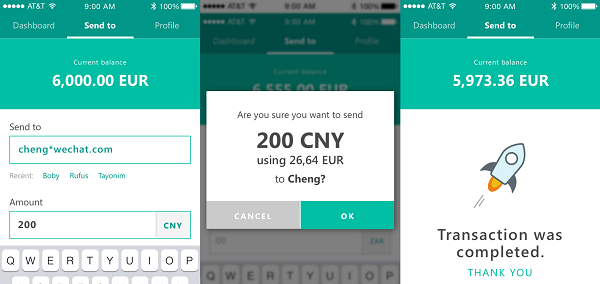

The DigitalBits federation protocol maps DigitalBits addresses to more information about a given user. It's a way for DigitalBits client software
to resolve email-like addresses such as `name*yourdomain.com` into account IDs like: `GCCVPYFOHY7ZB7557JKENAX62LUAPLMGIWNZJAFV2MITK6T32V37KEJU`. DigitalBits addresses provide
an easy way for users to share payment details by using a syntax that interoperates across different domains and providers.



## DigitalBits addresses

DigitalBits addresses are divided into two parts separated by `*`, the username and the domain.

For example:  `joe*digitalbits.io`:
* `joe` is the username,
* `digitalbits.io` is the domain.

The domain can be any valid RFC 1035 domain name.
The username is limited to printable UTF-8 with whitespace and the following characters excluded: <*,> Although of course the domain administrator can place additional restrictions on usernames of its domain.

Note that the `@` symbol is allowed in the username. This allows for using email addresses in the username of an address. For example: `maria@gmail.com*digitalbits.io`.

## Supporting Federation

### Step 1: Create a [digitalbits.toml](./digitalbits-toml.md) file

Create a file called digitalbits.toml and put it at `https://YOUR_DOMAIN/.well-known/digitalbits.toml`.

### Step 2: Add federation_url

Add a `FEDERATION_SERVER` section to your digitalbits.toml file that tells other people the URL of your federation endpoint.

For example: `FEDERATION_SERVER="https://api.yourdomain.com/federation"`

Please note that your federation server **must** use `https` protocol.

### Step 3: Implement federation url HTTP endpoint

The federation URL specified in your digitalbits.toml file should accept an HTTP GET request and issue responses of the form detailed below.

Instead of building your own server you can use the [`federation server`](https://github.com/xdbfoundation/go/tree/master/services/federation) built by DigitalBits Foundation.

## Federation Requests
You can use the federation endpoint to look up an account id if you have a DigitalBits address. You can also do reverse federation and look up a DigitalBits addresses from account ids or transaction ids. This is useful to see who has sent you a payment.

Federation requests are http `GET` requests with the following form:

`?q=<string to look up>&type=<name,id,txid>`

Supported types:
 - **name**: Example: `https://YOUR_FEDERATION_SERVER/federation?q=joe*digitalbits.io&type=name`
 - **forward**: Used for forwarding the payment on to a different network or different financial institution. The other parameters of the query will vary depending on what kind of institution is the ultimate destination of the payment and what you as the forwarding anchor supports. Your [digitalbits.toml](./digitalbits-toml.html) file should specify what parameters you expect in a `forward` federation request. If you are unable to forward or the other parameters in the request are incorrect you should return an error to this effect. Example request:   `https://YOUR_FEDERATION_SERVER/federation?type=forward&forward_type=bank_account&swift=BOPBPHMM&acct=2382376`
 - **id**: *not supported by all federation servers* Reverse federation will return the federation record of the DigitalBits address associated with the given account ID. In some cases this is ambiguous. For instance if an anchor sends transactions on behalf of its users the account id will be of the anchor and the federation server won't be able to resolve the particular user that sent the transaction. In cases like that you may need to use **txid** instead. Example: `https://YOUR_FEDERATION_SERVER/federation?q=GD6WU64OEP5C4LRBH6NK3MHYIA2ADN6K6II6EXPNVUR3ERBXT4AN4ACD&type=id`
 - **txid**: *not supported by all federation servers* Will return the federation record of the sender of the transaction if known by the server. Example: `https://YOUR_FEDERATION_SERVER/federation?q=c1b368c00e9852351361e07cc58c54277e7a6366580044ab152b8db9cd8ec52a
&type=txid`

### Federation Response
The federation server should respond with an appropriate HTTP status code, headers and a JSON response.

You must enable CORS on the federation server so clients can send requests from other sites. The following HTTP header must be set for all federation server responses.

```
Access-Control-Allow-Origin: *
```

When a record has been found the response should return `200 OK` http status code and the following JSON body:

```
{
  "digitalbits_address": <username*domain.tld>,
  "account_id": <account_id>,
  "memo_type": <"text", "id" , or "hash"> *optional*
  "memo": <memo to attach to any payment. if "hash" type then will be base64 encoded> *optional*
}
```

If a redirect is needed the federation server should return `3xx` http status code and immediately redirect the user to the correct URL using the `Location` header.

When a record has not been found `404 Not Found` http status code should be returned.

Every other http status code will be considered an error. The body should contain error details:

```
{
   "detail": "extra details provided by the federation server"
}
```

## Looking up federation provider via a home domain entry
Accounts may optionally have a [home domain](./accounts.md#home-domain) specified. This allows an account to programmatically specify where is the main federation provider for that account.

## Caching

You shouldn't cache responses from federation servers. Some organizations may generate random IDs to protect their users' privacy. Those IDs may change over time.
